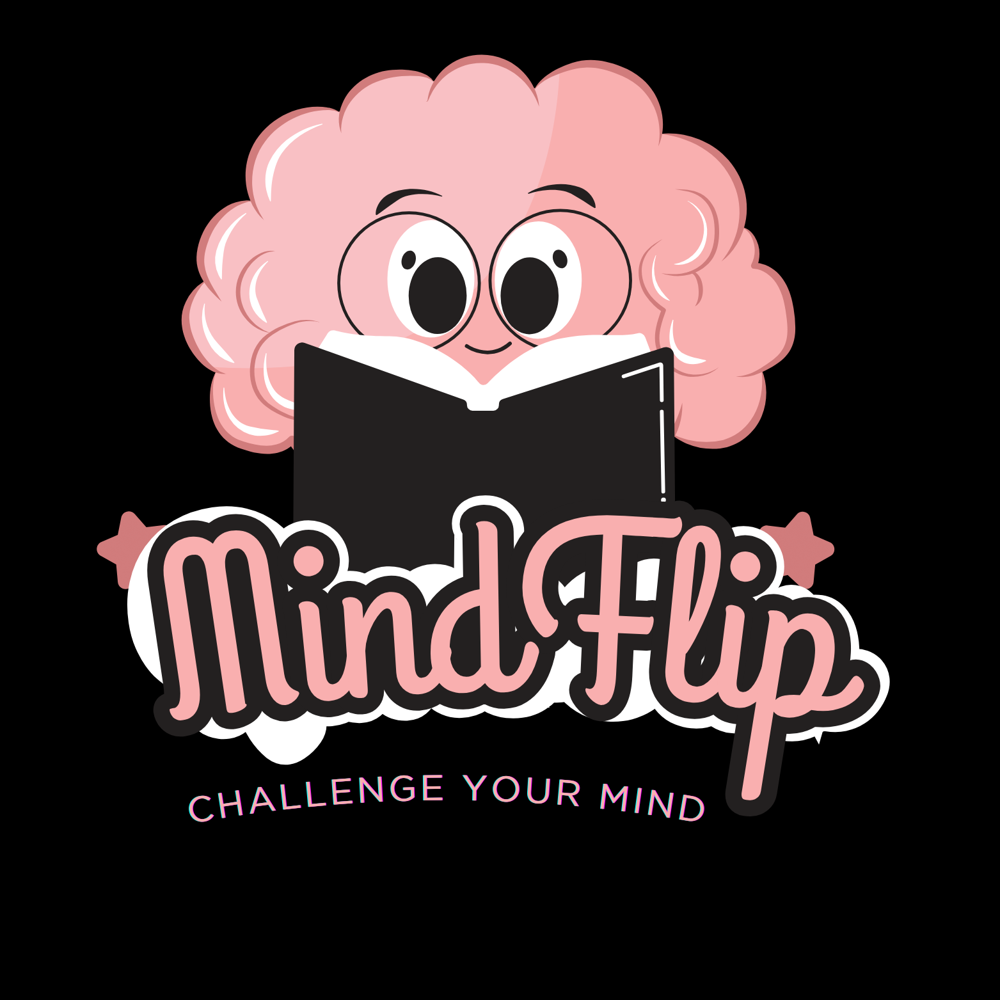

# Memory Match — MindFlip 32 Levels



A visually appealing **Memory Match Game** built with Python and Pygame. Test your memory skills across **32 challenging levels**, track your XP, unlock power-ups, and collect unique card faces!

---

## 🎮 Game Overview

Memory Match is a classic card-matching game where the player flips over cards to find matching pairs. This version includes:

- **32 Levels** of increasing difficulty
- **Single Player & Multiplayer** modes
- **Daily Challenges** with new puzzles each day
- **Training Mode** to improve memory skills
- **XP & Level System:** Gain experience and level up
- **Power-ups:** Shuffle, Bomb, Freeze to enhance gameplay
- **Collection:** Unlock and collect unique face images
- **Time & Moves Tracking**
- **High Score Saving** for each mode
- Smooth **animations & sound effects**
- Background music and interactive buttons
- Responsive card layout that scales with the window
- Polished UI with **logo and HUD**

---

## 🖼️ Assets

The project uses three main folders:

- `images/` — Card faces and back images (`1.png` to `32.png`, `back.png`)
- `sounds/` — Sound effects (`flip.wav`, `match.wav`, `mismatch.wav`, `win.wav`, `button.wav`)
- `assets/` — Font (`font.ttf`), background music (`bg_music.mp3`), logo (`logo.png`), and JSON files (`high_scores.json`, `profile.json`, `daily_scores.json`)

> Note: If any asset is missing, the game provides placeholders.

---

## 🛠️ Requirements

- Python 3.10+
- [Pygame](https://www.pygame.org/) library

Install Pygame using:

```bash
pip install pygame
```

---

## 🚀 How to Run

1. Clone the repository:

```bash
git clone https://github.com/Piyumi2025/MemoryMatchGame
cd memory-match-32-levels
```

2. Ensure the folders `images`, `sounds`, and `assets` are present with the required files.

3. Run the game:

```bash
python main.py
```

4. Controls:

* **Mouse Click** — Flip cards
* **ESC** — Return to Home screen
* **H** — View High Scores
* **SPACE / ENTER** — Start game from Home

---

## 📁 Folder Structure

```
memory-match-32-levels/
│
├─ images/
│   ├─ back.png
│   ├─ 1.png
│   ├─ 2.png
│   └─ ... up to 32.png
│
├─ sounds/
│   ├─ flip.wav
│   ├─ match.wav
│   ├─ mismatch.wav
│   ├─ win.wav
│   └─ button.wav
│
├─ assets/
│   ├─ font.ttf
│   ├─ bg_music.mp3
│   ├─ logo.png
│   ├─ high_scores.json
│   ├─ profile.json
│   └─ daily_scores.json
│
├─ main.py
└─ README.md
```

---

## 🎨 Features & Screenshots

* **Dynamic Card Layout:** Cards scale to fit the window based on the number of pairs
* **Multiplayer Mode:** Compete with friends on the same device
* **Daily Challenge:** New puzzles each day with separate scoring
* **Training Mode:** Practice without affecting scores
* **XP & Level System:** Gain experience and track streaks
* **Power-ups:** Shuffle, Bomb, Freeze with limited usage
* **Collection:** Unlock and view unique face images
* **High Scores Tracking:** Save best times per level and mode
* **Interactive Buttons:** Hover effects and sounds
* **Animated Flip & Match:** Visual feedback for matches and mismatches
* **Background Music & Sound Effects:** Enhance gameplay experience

---

## 🔧 Notes

* If a card image or sound is missing, the game will generate a placeholder and continue running.
* High scores, profiles, and daily scores are automatically saved in the `assets/` folder.
* The game plays background music in a loop. Volume can be adjusted in `main.py`.

---

## 📌 License

This project is open-source and free to use under the MIT License.

---

## 📂 GitHub Repository

Source code, assets, and full instructions are available on GitHub:  
[https://github.com/Piyumi2025/MemoryMatchGame](https://github.com/Piyumi2025/MemoryMatchGame)

---

Enjoy testing your memory, unlocking collections, and climbing all **32 levels**! 🧠💡
